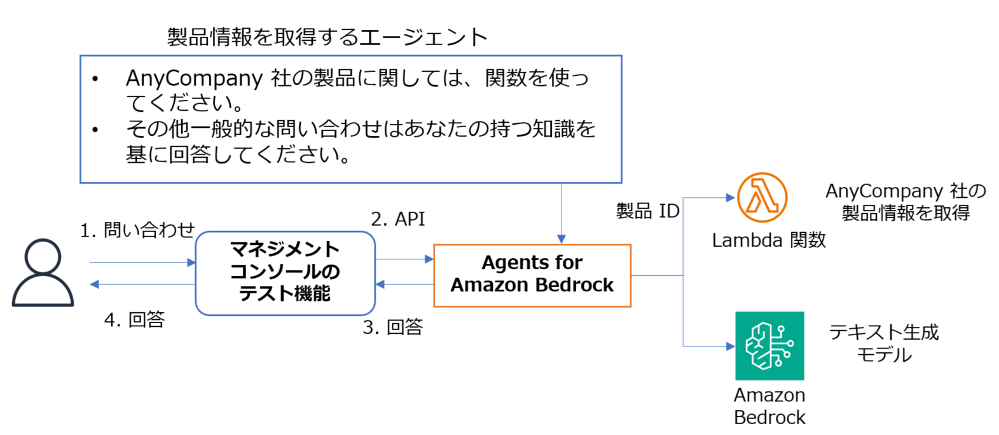

# Amazon Bedrock のエージェントを作成してみよう

* このワークでは、Amazon Bedrock のエージェントを作成します。
* 架空の会社 AnyCompany の製品情報を取得するツールを使用します。
* 作成したエージェントは、AWS マネジメントコンソールのテスト機能から動作確認を行います。



---
## 準備

* インストラクターが指定した環境で AWS マネジメントコンソールにサインインして下さい。
    - **このワークの環境は、ワークを実施する時間帯のみ使用可能です。**
* AWS マネジメントコンソールで、**指定されたリージョン**を選択した状態にしてください。
* ご自分に割り当てられた **2桁の番号**を覚えておいてください。

---
## 基盤モデルのアクセスの有効化

1. **他のワークですでに実施済の場合は、エージェントの作成手順に進んでください。**
1. AWS マネジメントコンソールのページ上部の **検索**で `bedrock` と入力して **Amazon Bedrock** のメニューを選択します。
1. ページ左側で **設定および学習** の **モデルアクセス** を選択します。
1. **特定のモデルを有効にする** を選択します。
    - もしくは **モデルアクセスを変更** を選択します。
1. 下記のモデルのチェックボックスをチェックします。（すでにチェックされている場合はエージェントの作成手順に進んでください）
    - **Amazon** の **Nova Lite**
1. **次へ** を選択します。
1. **送信** を選択します。

---
## Amazon Bedrock エージェントの作成

### エージェント名

1. ページ左側で **構築** の **エージェント** を選択します。
1. **エージェントを作成** を選択します。
1. **名前** に `product-agent` と入力します。
1. **作成** を選択します。
1. **エージェントビルダー** で **保存** を選択します。

### モデルの選択とエージェント向けの指示の入力

1. **モデルを選択** で **Amazon Nove Lite** を選択します。
1. **エージェント向けの指示** で下記を入力します。

```
あなたは優秀なAIアシスタントです。ユーザーからの質問や指示に対して、以下の手順で適切な回答を提供してください。 
1.ユーザーの依頼内容を注意深く読み、その内容が以下のどのカテゴリーに該当するか判断してください。 
  a) AnyCompany社の製品情報に関する質問 
  b) 一般的な知識に関する質問 
2.依頼内容が一般的な知識に関する質問であると判断した場合、あなたが持つ幅広い知識に基づいて、的確で分かりやすい回答を作成してください。 
3.依頼内容がAnyCompany社の製品情報に関する質問であると判断した場合、提示された製品ID をパラメータにして専用のfunctionを実行して製品情報を取得し、ユーザーに提供してください。 
4.回答する際は、ユーザーの知識レベルや関心に合わせて、技術的な詳細の量を調整するなど、わかりやすく親しみやすい言葉づかいを心がけてください。 以上の手順に従って、ユーザーの期待に応える高品質なアシスタントサービスを提供してください。
```

1. ページ上部の **保存** を選択します。


### アクショングループの作成

1. **アクショングループ** で **追加** を選択します。
1. **アクショングループ名を入力** で `product_action_group` を選択します。
    - 名前にハイフン(-) を含めないでください。アンダースコアは OK です。(Claude 使用時はこの限りではありません）
1. **アクショングループ関数 1** の **名前** に `get_product_function` を入力します。
    - 名前にハイフン(-) を含めないでください。アンダースコアは OK です。(Claude 使用時はこの限りではありません）
1. **パラメータ** で **パラメータを追加** を選択します。
1. **パラメータ** の **名前** に `product_id` を入力して チェックアイコンを選択します。
1. **パラメータ** の **説明** に `製品 ID` を入力して チェックアイコンを選択します。
1. ページ下部の **作成** を選択します。

### アクショングループの Lambda 関数名の確認

1. **アクショングループ** で 名前のリンクを選択します。
1. **アクショングループの呼び出し** で **Lambda 関数を選択**　に表示されている Lambda 関数名をメモしておきます。
1. ページ下部の **キャンセル** を選択します。
1. ページ上部の **保存して終了** を選択します。

### アクショングループの Lambda 関数のコードの編集

1. AWS Lambda のページをブラウザの新しいタブで開きます。
1. メモしておいた Lambda 関数の名前のリンクを選択します。
1. 既存の Lambda 関数のコードを削除し、下記のコードを貼り付けます。
    - ここでは、簡易的なダミーとして実装しています。

```
import json

products = {
   "P001": {"製品名称": "ロンドンウォーキングシューズ", "単価": 2000, "単価の通貨": "USD"},
   "P002": {"製品名称": "キングダム ハット", "単価": 1000, "単価の通貨": "USD"},
   "P003": {"製品名称": "冷凍食品: Fish & chips", "単価":8, "単価の通貨": "USD" }
}

def lambda_handler(event, context):
    agent = event['agent']
    actionGroup = event['actionGroup']
    function = event['function']
    parameters = event.get('parameters', [])
    #print(parameters)
    product_id = parameters[0]['value']
    print(product_id)
    product = products[product_id]
    product_info = json.dumps(product, ensure_ascii=False)

    # Execute your business logic here. For more information, refer to: https://docs.aws.amazon.com/bedrock/latest/userguide/agents-lambda.html
    responseBody =  {
        "TEXT": {
            "body": product_info
        }
    }

    action_response = {
        'actionGroup': actionGroup,
        'function': function,
        'functionResponse': {
            'responseBody': responseBody
        }

    }

    dummy_function_response = {'response': action_response, 'messageVersion': event['messageVersion']}
    print("Response: {}".format(dummy_function_response))

    return dummy_function_response
```

1. 左側にある **Deploy** を選択します。

### エージェントのテスト

1. Amazon Bedrock のページに戻ります。
1. ページ右側の **テスト** で **準備**　を選択します。
1. ページ下側で下記のプロンプトを入力します。
    - `AnyCompany社の製品ID P001 の製品の情報を教えてください。`
1. Enter キーで送信します。
1. モデルからの回答を確認します。
1. **トレースを表示＞**　を選択します。
1. **トレースステップ**　を展開して内容を確認します。

1. **Amazon Bedrock のエージェントで、ツール（Lambda 関数）を使用して問い合わせの回答を行えることを確認しました。**

---

### オプションタスク：作成したエージェントをコードから使用する
#### このタスクを実行する場合は今を実施して下さい。実施しない場合は、[リソースの削除](#リソースの削除) の手順を実行して下さい。

1. AWS マネジメントコンソールで、Bedrock のページを開き、ページ左側で **構築** の **エージェント** を選択します。

1. 作成したエージェントの名前のリンクを選択します。

1. **エージェントの概要** で、エージェントの **ID** をメモしておきます。

1. ページを下にスクロールして、**エイリアス** で **作成**　を選択します。

1. **エイリアス名** に `live` と入力します。

1. **バージョンを関連付ける** で **新しいバージョンを作成し、このエイリアスに関連付けます。** を選択します。

1. **エイリアスを作成** を選択します。

1. 作成したエイリアスの **エイリアス ID** をメモしておきます。

1. 講師が案内した開発環境へアクセスします。

1. ターミナルから以下のコマンドを実行して、AWS SDK for Python (boto3) を最新のものに更新します。(すでに実施済の場合は不要です。）
    - `pip3 install boto3 --upgrade`

1. 以下のファイルを開き、コードを確認します。
    - **bedrock-work/agent/call_agent.py**
    - **環境に合わせて必要な部分を書き換えて保存します。**
        - ヒント：6行目のエージェントの ID、7行目のエイリアスの ID

1. ターミナルから以下のコマンドを実行して、コードを実行します。
    - ```
      cd ~/environment/bedrock-work/agent/

      python3 call_agent.py
      
      ```

1. **コードから Bedrock のエージェントを使用した問い合わせができたことを確認しました。**

---
# リソースの削除

1. 以降は、作成したリソースの削除処理を行います。
---
## エージェントの削除
1. ページ左側で **構築** の **エージェント** を選択します。
1. **エージェント** で **product-agent** をラジオボタンを選択して、**削除** を選択します。
1. 確認のダイアログで `delete` と入力して **Delete** を選択します。

## Lambda 関数の削除
1. AWS Lambda のページに切り替えます。
1. 編集した Lambda 関数のページで **アクション** - **関数の削除** を選択します。
1. 確認のダイアログで **削除** を選択します。

## CloudWatch ログの削除
1. Amazon CloudWatch のページに切り替えます。
1. **ログ** - **ロググループ** を選択します。
1. /aws/lambda/(関数名) のロググループのチェックボックスをチェックして、**アクション** - **ロググループの削除** を選択します。
1. 確認のダイアログで **削除** を選択します。
   
---
### お疲れさまでした。

* **このワークの環境は、ワークを実施する時間帯のみ使用可能です。**


