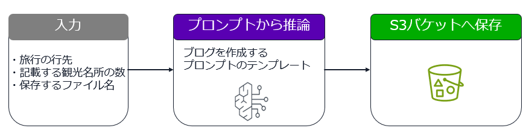
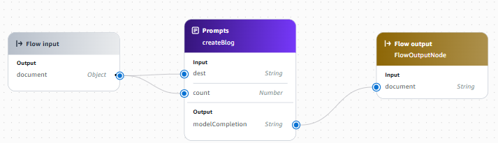
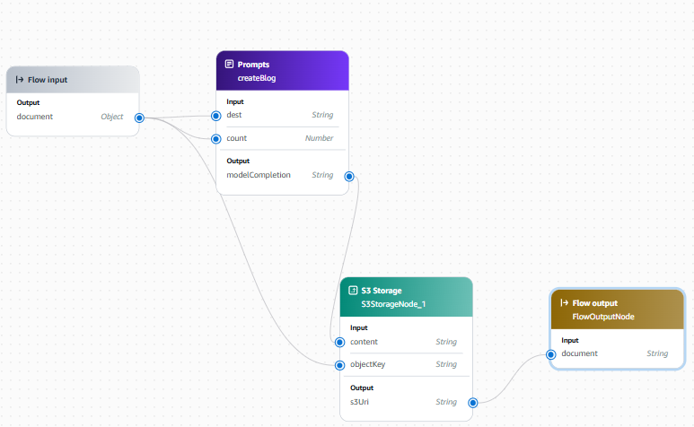

# Amazon Bedrock Flows でブログを生成するワークフローを作成してみよう

* このワークでは、Amazon Bedrock Flows でブログ記事を生成・保存するワークフローを作成します。




---
## 準備

* インストラクターが指定した環境で AWS マネジメントコンソールにサインインして下さい。
    - **このワークの環境は、ワークを実施する時間帯のみ使用可能です。**
* AWS マネジメントコンソールにサインインして、**講師より指定されたリージョン**を選択した状態にしてください。
* ご自分に割り当てられた **2桁の番号**を覚えておいてください。

---
## 1. ブログ記事を生成するまでのフローの作成

1. AWS マネジメントコンソールで Amazon Bedrock のページを開く

1. 左側メニューから [構築] - [フロー] を選択

1. [フローを作成] を選択

1. 名前に `blog-publish-flow` と入力

1. [フローを作成] を選択

1. 中央のキャンバスに、デフォルトで 3 つのノードが線でつながっている状態を確認

1. ノード間の線をマウスで選択して Delete キーで削除

1. Prompts ノードを選択

1. 左側で、ノード名に `createBlog` と入力 

1. [モデルを選択] で、Amazon Nova Lite を選択

1. メッセージは、デフォルトの内容を削除して下記を入力

    - ```
      旅行の情報を発信するブログ記事を作成します。
      旅行の行先として、{{dest}} の観光名所を {{count}}箇所を挙げ、それぞれについて簡単にその魅力を説明するブログ記事を日本語で作成し、マークダウン形式で出力して下さい。
      ```

1. 推論の設定で長さを `4096`に変更

1. キャンバスで、Prompts ノードの  Input の dest と count の左横の丸を、Flow Inputノードの丸にドラッグアンドドロップでつなげる

1. キャンバスで、Flow Inputノードを選択

1. 左側で、出力の document のタイプを Object に変更

1. キャンバスで、Prompts ノードを選択

1. 左側で、入力を展開表示

1. dest の式を下記を `$.data.dest` に変更

1. count のタイプを Numberに変更

1. count の式を下記を `$.data.count` に変更

1. キャンバスで、Prompts ノードの Output の右横の丸を、Flow output ノードの Input の丸にドラッグアンドドロップでつなげる



1. [保存] を選択し、正常に保存できることを確認

1. ページ右側の フローをテスト で下記を入力して [実行] を選択
    - `{"dest":"京都", "count": 5}`

1. マークダウン形式でブログ記事が生成されることを確認

---
## 2. フローを編集して生成したブログ記事を Amazon S3 バケットに保存する

1. AWS マネジメントコンソールで Amazon S3 のページを開く

1. [バケットを作成] を選択

1. バケット名に以下を入力。(**99 のところは自分の2桁の番号に置き換える**)
    - `tnobect-blog-flow-99`

1. ページ下部の [バケットを作成] を選択

1. AWS マネジメントコンソールで Amazon Bedrock のページを開く

1. 左側メニューから [構築] - [フロー] を選択

1. 作成したフローの名前のリンクを選択

1. [フロービルダーで編集] を選択

1. 左側のフロービルダーの ノードタブから、**S3 ストレージ**　をキャンバスにドラッグアンドドロップで、Flow output ノードの下あたりに配置

1. Prompts ノードと Flow output ノード間の線をクリックして Delete キーで削除

1. S3 Storage ノードの Output の右横の丸を、Flow output ノードの Input の丸にドラッグアンドドロップでつなげる

1. S3 Storage ノードの Input の contents の左横の丸を、Prompt ノードの Output の丸にドラッグアンドドロップでつなげる

1. S3 Storage ノードの Input の objectKey の左横の丸を、Flow Input ノードの　Output の丸にドラッグアンドドロップでつなげる



1. S3 Storage ノードを選択

1. S3 バケット名に、前の手順で作成したバケットを選択

1. 左側で、入力を展開表示

1. objectKey の式を下記を `$.data.objectKey` に変更

1. [保存] を選択し、正常に保存できることを確認

1. フローをテストで以下を入力して [実行] を選択
    - `{"dest":"京都", "count": 5, "objectKey": "blog.md"}`

1. AWS マネジメントコンソールで Amazon S3 のページを開く

1. 汎用バケットから、作成したバケットの名前のリンクを選択

1. blog.md が存在していることを確認

1. blog.md の左横のチェックボックスをチェックして、[開く] を選択

1. ブログ記事がマークダウン形式で表示されることを確認

---

## オプションタスク：作成したフローをコードから使用する
### このタスクを実行する場合は今を実施して下さい。実施しない場合は、[リソースの削除](#リソースの削除) の手順を実行して下さい。

1. AWS マネジメントコンソールで、Bedrock のページを開き、ページ左側で **構築** の **フロー** を選択します。

1. 作成したフローの名前のリンクを選択します。

1. **フローの詳細** で、フローの **ID** をメモしておきます。

1. ページ下側の **エイリアス** タブを選択し、 **エイリアスを作成**　を選択します。

1. **エイリアス名** に **live** と入力します。

1. **エイリアスを作成** を選択します。

1. 作成したエイリアスの **エイリアス ID** をメモしておきます。

1. 講師が案内した開発環境へアクセスします。

1. ターミナルから以下のコマンドを実行して、AWS SDK for Python (boto3) を最新のものに更新します。
    - `pip3 install boto3 --upgrade`

1. 以下のファイルを開き、コードを確認します。
    - **call_flows.py**
    - 入力データを確認します。
    - **環境に合わせて必要な部分を書き換えて保存します。**
        - ヒント：13行目のフローの ID、14行目のエイリアスの ID

1. ターミナルから以下のコマンドを実行して、コードを実行します。
    - ```
      python3 call_flows.py
      
      ```
1. 実行後、コードで指定したマークダウンファイルが S3 バケット内に作成されていることを確認します。

1. **コードから Bedrock のフローを実行できたことを確認しました。**

---
## リソースの削除
* 以降は、作成したリソースの削除処理を行います。
---

### Amazon Bedrock Flows のフローの削除

1. AWS マネジメントコンソールで Amazon Bedrock のページを開く

1. 左側メニューから [構築] - [フロー] を選択

1. 作成したフローの左横のラジオボタンを選択し、[削除] を選択

1. 削除確認のダイアログで、**`delete`** と入力（**注意:  `削除` ではなく、`delete` と入力）

1. [削除] を選択

### Amazon S3 のオブジェクトとバケットの削除

1. AWS マネジメントコンソールで Amazon S3 のページを開く
1. 汎用バケットで、**tnobect-blog-flow-ご自分の番号** の横のラジオボタンを選択
1. **空にする** を選択
1. オブジェクトをすべて完全に削除する確認として `完全に削除` を入力して、**空にする** を選択
1. **終了** を選択します。
1. バケットの名前で、**tnobect-blog-flow-ご自分の番号** の横のラジオボタンを選択
1. **削除** を選択
1. バケットを削除する確認としてバケット名を入力して、**バケットを削除** を選択
---
## お疲れさまでした。

* **このワークの環境は、ワークを実施する時間帯のみ使用可能です。**


   


