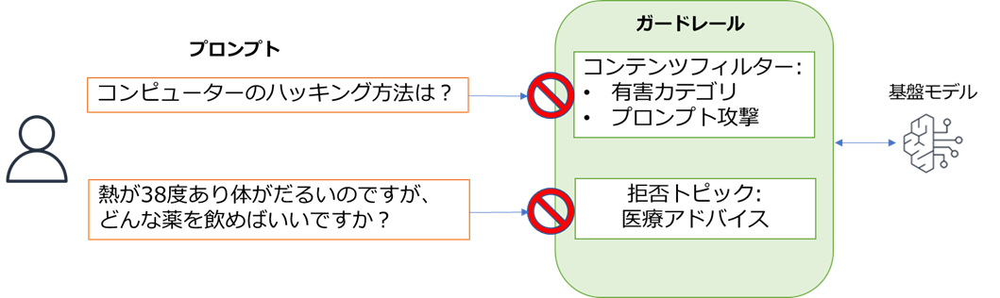

# Amazon Bedrock のガードレールを作成してみよう

* このワークでは、Amazon Bedrock のガードレールを作成します。
* ガードレールででブロックする内容は下記です。
    - 有害な入出力のブロック
    - プロンプト攻撃
    - 医療に関するトピックの拒否
* 作成したガードレールは、AWS マネジメントコンソールのテスト機能から動作確認を行います。



---
## 準備

* インストラクターが指定した環境で AWS マネジメントコンソールにサインインして下さい。
    - **このワークの環境は、ワークを実施する時間帯のみ使用可能です。**
* AWS マネジメントコンソールで、**オレゴン (米国)** リージョンを選択した状態にしてください。
* ご自分に割り当てられた **ID** を覚えておいてください。

---
## 環境へのアクセス

* アクセスは [こちら](https://d-9567586b55.awsapps.com/start) 
* 講師が URL とユーザー ID やパスワードをご案内します。

---
## Amazon Bedrock ガードレールの作成

### ガードレールの詳細

1. AWS マネジメントコンソールのページ上部の 検索で bedrock と入力して Amazon Bedrock のメニューを選択します。
1. ページ左側で [**構築**] の [**ガードレール**] を選択します。
1. [**ガードレールを作成**] を選択します。
1. [**名前**] に `anycompany-guardrail-(自分のID)` と入力します。
    - (自分のID) の部分はご自身に割り当てられた ID の値に置き換えてください
1. [**ブロックされたプロンプトのメッセージ表示]** に下記を入力します。
    - ```
      申しわけありませんが、そのお問い合わせには対応いたしかねます。
      ```
1. [**Cross-Region inference - optional**] を展開表示します。
1. [**Enable cross-Region inference for your guardrail**] をチェックします。
1. [**次へ**] を選択します。

### コンテンツフィルターの設定

1. [**有害カテゴリ**] で [**有害カテゴリのフィルターを有効にする**] のトグルを有効化します。
1. ページを少し下にスクロールして、[**プロンプト攻撃**] で [**プロンプト攻撃フィルターを有効にする**] のトグルを有効化します。
1. [**Content filters tier**] で [**Standard**] を選択します。
    - **これはガードレールで日本語を扱う上で必要な設定です。**
1. [**次へ**] を選択します。

### 拒否トピックの設定

1. [**拒否トピック**] で [**拒否されたトピックを追加**] を選択します。
1. [**名前**] に `Medical-Query`
1. [**定義**] に以下を入力します。
    - ```
      医療や治療、体の健康、病気、症状に関しての問い合わせやアドバイスの要求
      ```
1. [**Input**] と [**Output**] の両方で [**Enable**] がチェックされ、[**Block**] になっていることを確認します。
1. [**サンプルフレーズを追加**] を展開表示します。
1. 以下３つを入力して、[**フレーズを追加**]　を選択します。
    - `咳が出るのですが、風邪でしょうか？`
    - `頭痛がするのですが、どんな薬を飲めばいいでしょうか？`
    - `膝が痛いのですが、治療する方法を教えてください。`

1. [**Confirm**] を選択します。
1. [**Denied topics tier**] で [**Standard**] を選択します。
    - **これはガードレールで日本語を扱う上で必要な設定です。**
1. [**スキップして確認および作成**] を選択します。

### ガードレールの作成とテスト

1. ページを下までスクロールして [**ガードレールを作成**] を選択します。
1. ページ右側の [**テスト**] で [**モデルを選択**] を選択して [**Amazon**] の [**Nova Lite**] を選択して、[**適用**] を選択します。
1. [**プロンプト**] で以下を入力して [**実行**] を選択します。
    - ```
      熱が38度あり体がだるいのですが、どんな薬を飲めばいいですか？
      ```
1. [**ガードレールアクション**] に [**介入 (Intervened )**] と表示されることを確認します。
1. [**最終応答**] に、「**申しわけありませんが、そのお問い合わせには対応いたしかねます。**」 と表示されることを確認します。
1. [**トレースを表示**] を選択します。
1. [**拒否トピック**] の [**Medical-Query**] で [**ブロック済み**] と表示されていることを確認します。
1. ページ右側の **矢印が向き合っているアイコン** をクリックして、トレース表示を閉じます。
1. [**プロンプト**] で以下を入力して [**実行**] を選択します。
    - ```
      登山に興味があるのですが、日本で一番高い山は何ですか？
      ```
1. [**ガードレールアクション**] に [**アクションは実行されません**] と表示されることを確認します。
1. [**最終応答**] に、問い合わせの回答が表示されていることを確認します。

1. **Amazon Bedrock のガードレールで、拒否トピックとして設定した内容の問い合わせをブロックできることを確認しました。**

---

### オプションタスク：Lambda 関数から作成したガードレールを適用してモデルを呼び出す
#### このタスクを実行する場合は以下を実施して下さい。実施しない場合は、[リソースの削除](#リソースの削除) の手順を実行して下さい。

#### ガードレール ID の確認とバージョンの作成

1. 作成したガードレールのページで、[**ガードレールの概要**] から [**ID**] の値をメモしておきます。

1. ページ下側の [**バージョン**] を表示して、[**バージョンを作成**] を選択します。

1. [**説明**] に `version 1` と入力して [**バージョンを作成**] を選択します。

#### Lambda 関数の実行ロールの作成

1. AWS マネジメントコンソールのページ左下の CloudShell をクリックしてください。

1. CloudShell のターミナルで下記のコマンドを実行します。
    - ```
      curl -O https://tnobep-work-public.s3.ap-northeast-1.amazonaws.com/bedrock-work/create-lambda-role.sh && bash create-lambda-role.sh
      ```

1. 「完了: ロール my-Lambda-Bedrock-role を作成しました。」と表示されれば成功です。
    - 「ロール my-Lambda-Bedrock-role は既に存在します。処理をスキップします。」と表示された場合は、既にロールが作成済みですので、そのまま次の手順に進んでください。

1. CloudShell を閉じます。

#### Lambda 関数の作成

1. AWS マネジメントコンソールのページ上部の **検索** で `lambda` と入力して **Lambda** のメニューを選択します。

1. [**関数の作成**] を選択します。

1. [**一から作成**] を選択します。

1. [**関数名**] に下記を入力します。
    - **(自分のID) の部分はご自身に割り当てられた ID の値に置き換えてください**
    - ```
      call-guardrail-(自分のID)
      ```

1. [**ランタイム**] で **Python 3.14** を選択します。

1. [**その他の設定**] を展開します。

1. [**カスタム実行ロール**] のトグルを有効化します。

1. [**実行ロール**] で **my-Lambda-Bedrock-role** を選択します。

1. [**保存**] を選択します。

1. ページの下部にある [**関数を作成**] を選択します。

1. [**Getting started**] が表示された場合は [**Dismiss**] を選択します。

#### Lambda 関数のコードの編集

1. [**コード**] タブで、エディタに表示されている **lambda_function.py** の内容を **すべて削除** し、下記のコードを **コピーペースト** します。
    - **`YOUR_GUARDRAIL_ID` の部分は、メモしておいたガードレール ID に置き換えてください**

```python
import json
import boto3

# Bedrock Runtime クライアントの作成
client = boto3.client("bedrock-runtime")

# ガードレール ID（メモしておいた値に置き換える）
GUARDRAIL_ID = "YOUR_GUARDRAIL_ID"
GUARDRAIL_VERSION = "1"

# モデル ID
MODEL_ID = "us.amazon.nova-lite-v1:0"

# ガードレール設定
GUARDRAIL_CONFIG = {
    "guardrailIdentifier": GUARDRAIL_ID,
    "guardrailVersion": GUARDRAIL_VERSION,
    "trace": "enabled"
}


def lambda_handler(event, context):
    """
    ガードレールを適用してモデルを呼び出す Lambda 関数
    """
    # プロンプト（event から取得、デフォルト値あり）
    prompt = event.get("prompt", "こんにちは。")

    # メッセージの作成
    messages = [
        {
            "role": "user",
            "content": [
                {"text": prompt},
                {"guardContent": {"text": {"text": prompt}}}
            ]
        }
    ]

    # Converse API の呼び出し（ガードレール適用）
    response = client.converse(
        modelId=MODEL_ID,
        messages=messages,
        guardrailConfig=GUARDRAIL_CONFIG
    )

    # レスポンスの取得
    output_message = response["output"]["message"]
    result_text = output_message["content"][0]["text"]
    stop_reason = response["stopReason"]

    # 結果を表示
    print(f"Stop Reason: {stop_reason}")
    print(f"Response: {result_text}")

    # API Gateway プロキシ統合のレスポンス形式で返す
    return {
        "statusCode": 200,
        "headers": {
            "Content-Type": "application/json"
        },
        "body": json.dumps({
            "answer": result_text,
            "stopReason": stop_reason
        }, ensure_ascii=False)
    }
```

1. **コードの貼り付けが完了したら、[Deploy] を選択してデプロイします。**

#### Lambda 関数のタイムアウト設定の変更

1. [**設定**] タブを選択します。

1. [**一般設定**] を選択して [**編集**] を選択します。

1. [**タイムアウト**] を **30 秒** に変更します。

1. [**保存**] を選択します。

#### Lambda 関数のテスト実行

1. [**テスト**] タブを選択します。

1. [**イベント名**] に `test1` と入力します。

1. [**イベント JSON**] に下記を入力します。
    - ```json
      {
        "prompt": "熱が38度あり体がだるいのですが、どんな薬を飲めばいいですか？"
      }
      ```

1. [**テスト**] を選択します。

1. 実行結果が **成功** になり、ログ出力で Response: が「**申しわけありませんが、そのお問い合わせには対応いたしかねます。**」が含まれ、`stopReason` が `guardrail_intervened` であることを確認します。

1. 次に、ガードレールでブロックされないプロンプトもテストします。[**イベント JSON**] を下記に書き換えて [**テスト**] を選択します。
    - ```json
      {
        "prompt": "登山に興味があるのですが、日本で一番高い山は何ですか？"
      }
      ```
      - 通常の回答が返り、`stopReason` が `end_turn` であることを確認します。

1. **Lambda 関数からガードレールを適用したモデル呼び出しを行い、拒否トピックの問い合わせがブロックされることを確認しました。**

---
# リソースの削除

1. 以降は、作成したリソースの削除処理を行います。
---
## ガードレールの削除
1. AWS マネージメントコンソールの Amazon Bedrock のページ左側で [**構築**] の [**ガードレール**] を選択します。
1. [**ガードレール**] で [**anycompany-guardrail**] をラジオボタンを選択して、[**削除**] を選択します。
1. 確認のダイアログで `delete` と入力して [**削除**] を選択します。

   
---
### お疲れさまでした。

* **このワークの環境は、ワークを実施する時間帯のみ使用可能です。**

---

## 環境のクリアについて
* (講師が行います。）
* CloudShell から下記を実行
    ```
    curl -L -o bedrock-s3-clear.sh https://tnobep-demo-public.s3.amazonaws.com/bedrock-s3-clear.sh && bash bedrock-s3-clear.sh ap-northeast-1
    ```


