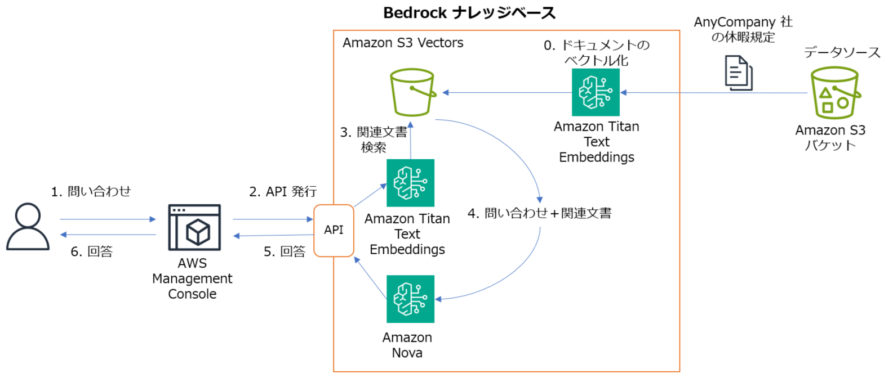

# Amazon Bedrock のナレッジベースを作成してみよう

* このワークでは、Amazon Bedrock のナレッジベースを作成します。
* 架空の会社 AnyCompany の休暇規定の PDF ファイルを Amazon S3 バケットに格納しデータソースとします。
* Embed モデルとして Amazon Titan Text Embeddings v2 を使用します。
* ベクトルデータベースとして Amazon S3 Vectors を使用します。
* 作成したナレッジベースは、AWS マネジメントコンソールのテスト機能から動作確認を行います。



---
## 準備

* インストラクターが指定した環境で AWS マネジメントコンソールにサインインして下さい。
    - **このワークの環境は、ワークを実施する時間帯のみ使用可能です。**
* AWS マネジメントコンソールにサインインして、**講師より指定されたリージョン**を選択した状態にしてください。
* ご自分に割り当てられた **2桁の番号**を覚えておいてください。
* 下記をクリックして、Download Raw file アイコンから **AnyCompany.pdf** をダウンロードして下さい。
    - (https://github.com/tetsuo-nobe/bedrock-work/blob/main/knowledgebase/AnyCompany.pdf)
    - この PDF は架空の会社 AnyCompany の休暇規定です。

---
## Amazon S3 バケットの作成と PDF ファイルの格納

1. AWS マネジメントコンソールのページ上部の **検索**で `s3` と入力して **S3** のメニューを選択します。
1. **バケットを作成**　を選択します。
1. **バケット名**は下記のようにしてしてください。
    - `tnobect-bedrock-work-kb-ご自分の番号`
    - 例: tnobect-bedrock-work-kb-99
1. ページを下までスクロールして **バケットを作成** を選択します。    
1. 汎用バケットの一覧表示で、作成したバケットの名前のリンクを選択します。
1. **アップロード** をクリックします。
1. **ファイルを追加** をクリックしてダウンロードしていた **AnyCompany.pdf** を指定します。
1. **アップロード**　を選択します。
1. **閉じる**　を選択します。


---
## 基盤モデルのアクセスの有効化

1. AWS マネジメントコンソールのページ上部の **検索**で `bedrock` と入力して **Amazon Bedrock** のメニューを選択します。
1. ページ左側で **設定および学習** の **モデルアクセス** を選択します。
    - **もし モデルアクセス のメニューが存在しない場合、「Amazon Bedrock ナレッジベースの作成」に進んで下さい。**
    - **もし モデルアクセス を選択した時、モデルの一覧やオレンジ色のボタンが表示されていない場合、「Amazon Bedrock ナレッジベースの作成」に進んで下さい。**
1. **特定のモデルを有効にする** を選択します。
    - もしくは **モデルアクセスを変更** を選択します。
1. 下記のモデルのチェックボックスをチェックします。（すでにチェックされている場合はナレッジベース作成手順に進んでください）
    - **Amazon** の **Titan Text Embeddings V2** 
    - **Amazon** の **Nova Lite**
1. **次へ** を選択します。
1. **送信** を選択します。

---
## Amazon Bedrock ナレッジベースの作成

### ナレッジベース名

1. ページ左側で **構築** の **ナレッジベース** を選択します。
1. **作成** から **ベクトルストアを含むナレッジベース** を選択します。
1. **ナレッジベース名** に `AnyCompany-kb` と入力します。
1. **IAM 許可** の **ランタイムロール** で **新しいサービスロールを作成して使用** を選択します。
1. **サービスロール名**　はデフォルトのままにしておきます。

### データソースの指定

1. **データソースの選択** で **Amazon S3** を選択します。
1. **次へ** を選択します。
1. **データソース名** に `AnyCompany-kb-ds` と入力します。
1. **S3 URI** に下記のように入力します。
    - `s3://tnobect-bedrock-work-kb-自分の番号`
    - 例: s3://tnobect-bedrock-work-kb-99
1. その他はすべてデフォルトのままにして **次へ** を選択します。

### 埋め込みモデルの指定

1. **埋め込みモデル** で **モデルを選択** を選択します。
1. **Amazon** の **Titan Embneddings V2** を選択します。
1. **適用** を選択します。

### ベクトルデータベースの指定

1. **ベクトルデータベース**　セクションを表示します。 
1. **ベクトルストアの作成方法** **新しいベクトルストアをクイック作成** を選択します。
1. **ベクトルストア** で **Amazon S3 Vectors** を選択します。
1. **次へ** を選択します。
1. ページを下にスクロールして **ナレッジベースを作成** をクリックします。
1. 作成が完了するまで数分待ちます。

### データソースの同期

1. **AnyCompany-kb** のページで **データソース** のセクションを表示します。
1. **AnyCompany-kb-ds** のチェックボックスをチェックして **同期** を選択します。
1. ページ上部に緑色で同期の完了メッセージが出るまで待ちます。

### データソースのテスト

1. **ナレッジベースをテスト** を選択します。
1. **モデルを選択** を選択します。
1. **Amazon** の **Nova Lite** を選択して **適用** を選択します。
1. ページ下側で下記のプロンプトを入力します。
    - `AnyCompany社では社員が結婚するときに何日間休暇が与えられますか？`
1. Enter キーで送信します。
1. モデルからの回答を確認します。
1. 他にも下記のようなプロンプトを試してみましょう
    - `AnyCompany社の就業規則は労働基準法の第何条に基づいて規定されていますか？`
    - `AnyCompany社では社員が裁判員になった場合に休暇は与えられますか？`
    - `AnyCompany社では取得しなかった有給休暇は繰越すことができますか？`

1. **Amazon Bedrock のナレッジベースで、企業の独自のデータを使用して基盤モデルに問い合わせを行えることを確認しました。**

---

### オプションタスク：作成したナレッジベースをコードから使用する
#### このタスクを実行する場合は今を実施して下さい。実施しない場合は、[リソースの削除](#リソースの削除) の手順を実行して下さい。

1. AWS マネジメントコンソールで、Bedrock のページを開き、ページ左側で **構築** の **ナレッジベース** を選択します。

1. 作成したナレッジベースの名前のリンクを選択します。
  
1. **ナレッジベースの概要** で **ナレッジベース ID** をメモしておきます。

1. 講師が案内した開発環境へアクセスします。

1. ターミナルから以下のコマンドを実行して、AWS SDK for Python (boto3) を最新のものに更新します。
    - `pip3 install boto3 --upgrade`

1. 以下のファイルを開き、コードを確認します。
    - **bedrock-work/knowledgebase/call_kb.py**
    - **環境に合わせて必要な部分を書き換えて保存します。**
        - ヒント：8行目のリージョンと AWS アカウント ID、9行目のナレッジベースの ID

1. ターミナルから以下のコマンドを実行して、コードを実行します。
    - ```
      cd ~/environment//bedrock-work/knowledgebase/
  
      python3 call_kb.py

      ```

1. **コードから Bedrock のナレッジベースを使用した問い合わせができたことを確認しました。**

---
###  リソースの削除

*  以降は、作成したリソースの削除処理を行います。
---
## ナレッジベースの削除
1. ページ左側で **構築** の **ナレッジベース** を選択します。
1. **ナレッジベース** で **AnyCompany-kb** をラジオボタンを選択して、**削除** を選択します。
1. 確認のダイアログで `delete` と入力して **削除** を選択します。
1. 3 分ほど待っても削除処理が完了しない場合、ページをリロードしてみてください。

## Amazon S3 Vectors の削除
1. AWS マネジメントコンソールのページ上部の **検索**で `s3` と入力して **Amazon S3** のメニューを選択します。
1. ページ左側で **ベクトルバケット** を選択します。
1. **bedrock-knowledge-base-** から始まるベクトルバケット名をメモして、その名前のリンクを選択します。
1. **bedrock-knowledge-base-** から始まるベクトルインデックス名をメモしします。
1. マネジメントコンソールの上の黒いバーにある **CloudShell** のアイコン（検索入力エリアの右側）をクリックします。
    - CloudShell が起動し、ページ下側でコマンドが入力できるようになります。
1. 下記のコマンドを実行して、ベクトルインデックスとベクトルバケットを削除します。
    - BUCKET や INDEX の値は、メモしておいた名前に置き換えてから実行して下さい。
    - ```
      BUCKET=メモしておいたベクトルバケット名
      INDEX=メモしておいたベクトルインデックス名

      aws s3vectors delete-index --vector-bucket-name "${BUCKET}" \
                  --index-name "${INDEX}"
      aws s3vectors delete-vector-bucket \
          --vector-bucket-name "${BUCKET}"
      ```

1. CloudShell の右上にある X をクリックして閉じます。

## Amazon S3 のオブジェクトとバケットの削除

1. AWS マネジメントコンソールのページ上部の **検索**で `s3` と入力して **S3** のメニューを選択します。
1. バケットの名前で、**tnobect-bedrock-work-kb-ご自分の番号** の横のラジオボタンを選択します。
1. **空にする** を選択します。
1. オブジェクトをすべて完全に削除する確認として `完全に削除` を入力して、**空にする** を選択します。
1. **終了** を選択します。
1. バケットの名前で、**tnobect-bedrock-work-kb-ご自分の番号** の横のラジオボタンを選択します。
1. **削除** を選択します。
1. バケットを削除する確認としてバケット名を入力して、**バケットを削除** を選択します。
---
### お疲れさまでした。

* **このワークの環境は、ワークを実施する時間帯のみ使用可能です。**

