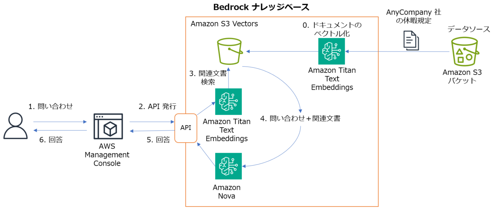

# Amazon Bedrock のナレッジベースを作成してみよう

* このワークでは、Amazon Bedrock のナレッジベースを作成します。
* 架空の会社 AnyCompany の休暇規定の PDF ファイルを Amazon S3 バケットに格納しデータソースとします。
* Embed モデルとして Amazon Titan Text Embeddings v2 を使用します。
* ベクトルデータベースとして Amazon S3 Vectors を使用します。
* 作成したナレッジベースは、AWS マネジメントコンソールのテスト機能から動作確認を行います。



---
## 準備

* インストラクターが指定した環境で AWS マネジメントコンソールにサインインして下さい。
    - **このワークの環境は、ワークを実施する時間帯のみ使用可能です。**
* AWS マネジメントコンソールにサインインして、**オレゴン (米国)**を選択した状態にしてください。
* ご自分に割り当てられた **ID** を覚えておいてください。
* 下記リンクを右クリックして、リンク先保存を選択して **AnyCompany.pdf** をダウンロードして下さい。
    - (https://dl39k3l39to9h.cloudfront.net/pdfs/AnyCompany.pdf)
    - この PDF は架空の会社 AnyCompany の休暇規定です。

---
## 環境へのアクセス

* アクセスは [こちら](https://d-9567586b55.awsapps.com/start) 
* 講師が URL とユーザー ID やパスワードをご案内します。

---
## Amazon S3 バケットの作成と PDF ファイルの格納

1. AWS マネジメントコンソールのページ上部の **検索**で `s3` と入力して **S3** のメニューを選択します。
1. [**バケットを作成**] を選択します。
1. [**バケット名**] は下記のようにしてしてください。
    - **(自分のID) の部分はご自身に割り当てられた ID の値に置き換えてください**
    - ```
      tnobect-0729-work-(自分のID)
      ```
    - 例: tnobect-0729-work-99
1. ページを下までスクロールして [**バケットを作成**] を選択します。    
1. 汎用バケットの一覧表示で、**作成したバケットの名前のリンク**を選択します。
1. [**アップロード**] をクリックします。
1. [**ファイルを追加**] をクリックしてダウンロードしていた **AnyCompany.pdf** を指定します。
1. [**アップロード**]　を選択します。
1. [**閉じる**]　を選択します。

---
## Amazon Bedrock ナレッジベースの作成

### ナレッジベース名

1. AWS マネジメントコンソールのページ上部の **検索**で `bedrock` と入力して **Amazon Bedrock** のメニューを選択します。
1. ページ左側で [**構築**] の [**ナレッジベース**] を選択します。
1. [**Create Managed KB**] から [**Unstructured Vector Store KB**] を選択します。
1. [**ナレッジベース名**] に下記を入力します。
    - **(自分のID) の部分はご自身に割り当てられた ID の値に置き換えてください**
    - ```
      AnyCompany-kb-(自分のID)
      ``` 
1. [**IAM 許可**] の [**ランタイムロール**] で [**新しいサービスロールを作成して使用**] を選択します。
1. [**サービスロール名**]　はデフォルトのままにしておきます。

### データソースの指定

1. [**データソースの選択**] で **Amazon S3** を選択します。
1. [**次へ**] を選択します。
1. [**データソース名**] に下記を入力します。
    - ```
      AnyCompany-kb-ds
      ```
1. [**S3 の URI**] で [**S3 を参照**] を選択します。
1. 作成した S3 バケット名のラジオボタンを選択して、[**選択**] を選択します。
1. その他はすべてデフォルトのままにして [**次へ**] を選択します。

### 埋め込みモデルの指定

1. [**埋め込みモデル**] で [**モデルを選択**] を選択します。
1. [**Amazon**] の [**Titan Embneddings V2**] を選択します。
1. [**適用**] を選択します。

### ベクトルデータベースの指定

1. [**ベクトルデータベース**]　セクションを表示します。 
1. [**ベクトルストアの作成方法**] で [**新しいベクトルストアをクイック作成**] を選択します。
1. [**ベクトルストア**] で [**Amazon S3 Vectors**] を選択します。
1. [**次へ**] を選択します。
1. ページを下にスクロールして [**ナレッジベースを作成**] をクリックします。
1. 作成が完了するまで数分待ちます。

### データソースの同期

1. [**AnyCompany-kb**] のページで [**データソース**] のセクションを表示します。
1. [**AnyCompany-kb-ds**] のチェックボックスをチェックして [**同期**] を選択します。
1. ページ上部に緑色で同期の完了メッセージが出るまで待ちます。

### ナレッジベースのテスト

1. [**ナレッジベースをテスト**] を選択します。
1. [**モデルを選択**] を選択します。
1. [**Amazon**] の [**Nova Lite**] を選択して [**適用**] を選択します。
1. ページ下側で下記のプロンプトを入力します。
    - ```
      AnyCompany社では社員が結婚するときに何日間休暇が与えられますか？
      ```
1. Enter キーで送信します。
1. モデルからの回答を確認します。**7日間** と出力されるはずです。
1. 他にも下記のようなプロンプトを試してみましょう
    - ```
      AnyCompany社の就業規則は労働基準法の第何条に基づいて規定されていますか？
      ```
      - **第89条** と出力されるはずです。
    - ```
      AnyCompany社では社員が裁判員になった場合に休暇は与えられますか？
      ```
      - **必要な日数、必要な時間の休暇が与えられる** と出力されるはずです。
    - ```
      AnyCompany社では取得しなかった有給休暇は繰越すことができますか？
      ```
      - **付与日から1年以内に取得しなかった年次有給休暇は、付与日から2年以内に限り繰り越して取得可能** と出力されるはずです。

1. **Amazon Bedrock のナレッジベースで、企業の独自のデータを使用して基盤モデルに問い合わせを行えることを確認しました。**

---

### オプションタスク：Lambda 関数から作成したナレッジベースを呼び出す
#### このタスクを実行する場合は以下を実施して下さい。実施しない場合は、[リソースの削除](#リソースの削除) の手順を実行して下さい。

#### ナレッジベース ID の確認

1. AWS マネジメントコンソールで、Bedrock のページを開き、ページ左側で **構築** の **ナレッジベース** を選択します。

1. 作成したナレッジベースの名前のリンクを選択します。

1. [**ナレッジベースの概要**] で [**ナレッジベース ID**] をメモしておきます。

#### Lambda 関数の実行ロールの作成

1. AWS マネジメントコンソールのページ左下の CloudShell をクリックしてください。

1. CloudShell のターミナルで下記のコマンドを実行します。
    - ```
      curl -O https://tnobep-work-public.s3.ap-northeast-1.amazonaws.com/bedrock-work/create-lambda-role.sh && bash create-lambda-role.sh
      ```

1. 「完了: ロール my-Lambda-Bedrock-role を作成しました。」と表示されれば成功です。
    - 「ロール my-Lambda-Bedrock-role は既に存在します。処理をスキップします。」と表示された場合は、既にロールが作成済みですので、そのまま次の手順に進んでください。

1. CloudShell を閉じます。

#### Lambda 関数の作成

1. AWS マネジメントコンソールのページ上部の **検索** で `lambda` と入力して **Lambda** のメニューを選択します。

1. [**関数の作成**] を選択します。

1. [**一から作成**] を選択します。

1. [**関数名**] に下記を入力します。
    - **(自分のID) の部分はご自身に割り当てられた ID の値に置き換えてください**
    - ```
      call-kb-(自分のID)
      ```

1. [**ランタイム**] で **Python 3.14** を選択します。

1. [**その他の設定**] を展開します。

1. [**カスタム実行ロール**] のトグルを有効化します。

1. [**実行ロール**] で **my-Lambda-Bedrock-role** を選択します。

1. [**保存**] を選択します。

1. ページの下部にある [**関数を作成**] を選択します。

1. [**Getting started**] が表示された場合は [**Dismiss**] を選択します。

#### Lambda 関数のコードの編集

1. [**コード**] タブで、エディタに表示されている **lambda_function.py** の内容を **すべて削除** し、下記のコードを **コピーペースト** します。
    - **`YOUR_KNOWLEDGE_BASE_ID` の部分は、メモしておいたナレッジベース ID に置き換えてください**

```python
import json
import boto3

# Bedrock Agent Runtime クライアントの作成
client = boto3.client("bedrock-agent-runtime")

# ナレッジベース ID（メモしておいた値に置き換える）
KNOWLEDGE_BASE_ID = "YOUR_KNOWLEDGE_BASE_ID"

# モデル ARN
MODEL_ARN = "arn:aws:bedrock:us-west-2::foundation-model/amazon.nova-lite-v1:0"


def lambda_handler(event, context):
    """
    作成したナレッジベースを呼び出して結果を返す Lambda 関数
    """
    # プロンプト（event から取得、デフォルト値あり）
    prompt = event.get("prompt", "こんにちは。")

    # ナレッジベースを使用した retrieve_and_generate の呼び出し
    response = client.retrieve_and_generate(
        input={"text": prompt},
        retrieveAndGenerateConfiguration={
            "type": "KNOWLEDGE_BASE",
            "knowledgeBaseConfiguration": {
                "knowledgeBaseId": KNOWLEDGE_BASE_ID,
                "modelArn": MODEL_ARN
            }
        }
    )

    # レスポンスからテキストを取得して表示
    result_text = response["output"]["text"]
    print(result_text)

    # API Gateway プロキシ統合のレスポンス形式で返す
    return {
        "statusCode": 200,
        "headers": {
            "Content-Type": "application/json"
        },
        "body": json.dumps({"answer": result_text}, ensure_ascii=False)
    }
```

1. **コードの貼り付けが完了したら、[Deploy] を選択してデプロイします。**

#### Lambda 関数のタイムアウト設定の変更

1. [**設定**] タブを選択します。

1. [**一般設定**] を選択して [**編集**] を選択します。

1. [**タイムアウト**] を **30 秒** に変更します。

1. [**保存**] を選択します。

#### Lambda 関数のテスト実行

1. [**テスト**] タブを選択します。

1. [**イベント名**] に `test1` と入力します。

1. [**イベント JSON**] に下記を入力します。
    - ```json
      {
        "prompt": "AnyCompany社では社員が結婚するときに何日間休暇が与えられますか？"
      }
      ```

1. [**テスト**] を選択します。

1. 実行結果が **成功** になり、[**ログ出力**] セクションに回答が表示されます。

1. 他にも下記のプロンプトでテストしてみましょう。[**イベント JSON**] を書き換えて [**テスト**] を選択します。
    - ```json
      {
        "prompt": "AnyCompany社の就業規則は労働基準法の第何条に基づいて規定されていますか？"
      }
      ```
      - **第89条** を含む回答が表示されるはずです。

1. **Lambda 関数から Bedrock のナレッジベースを呼び出し、企業の独自データを使った問い合わせができることを確認しました。**

* 参考ドキュメント: [boto3 ドキュメントの retrieve_and_generate](https://boto3.amazonaws.com/v1/documentation/api/latest/reference/services/bedrock-agent-runtime/client/retrieve_and_generate.html)
---
###  リソースの削除

*  以降は、作成したリソースの削除処理を行います。
---
## ナレッジベースの削除
1. AWS マネージメントコンソールのページ左側で [**構築**] の [**ナレッジベース**] を選択します。
1. [**ナレッジベース**] で [**AnyCompany-kb**] をラジオボタンを選択して、[**削除**] を選択します。
1. 確認のダイアログで `delete` と入力して [**削除**] を選択します。
1. 1 分ほど待っても削除処理が完了しない場合、ページをリロードしてみてください。

## Amazon S3 Vectors の削除
1. AWS マネジメントコンソールのページ上部の **検索** で `s3` と入力して **Amazon S3** のメニューを選択します。
1. ページ左側で [**ベクトルバケット**] を選択します。
1. **bedrock-knowledge-base-** から始まるベクトルバケット名のリンクを選択します。
1. **bedrock-knowledge-base-** から始まるベクトルインデックス名の左横のラジオボタンを選択します。
1. **削除** をクリックして、確認のダイアログで `削除` を入力し、**ベクトルインデックスを削除** を選択します。
1. ページ左側で [**ベクトルバケット**] を選択します。
1. **bedrock-knowledge-base-** から始まるベクトルバケット名の左横のラジオボタンを選択します。
1. **削除** をクリックして、確認のダイアログで `削除` を入力し、**ベクトルバケットを削除** を選択します。
   
* 参考: AWS CLI でベクトルインデックスとベクトルバケットを削除する場合は、以下のように行います。
    - BUCKET や INDEX の値は、メモしておいた名前に置き換えてから実行して下さい。
    - ```
      BUCKET=メモしておいたベクトルバケット名
      INDEX=メモしておいたベクトルインデックス名

      aws s3vectors delete-index --vector-bucket-name "${BUCKET}" \
                  --index-name "${INDEX}"
      aws s3vectors delete-vector-bucket \
          --vector-bucket-name "${BUCKET}"
      ```

## Amazon S3 のオブジェクトとバケットの削除

1. AWS マネジメントコンソールのページ上部の **検索** で `s3` と入力して **S3** のメニューを選択します。
1. バケットの名前で、**tnobect-0729-work-ご自分の番号** の横のラジオボタンを選択します。
1. [**空にする**] を選択します。
1. オブジェクトをすべて完全に削除する確認として `完全に削除` を入力して、[**空にする**] を選択します。
1. [**終了**] を選択します。
1. バケットの名前で、**tnobect-0729-work-ご自分の番号** の横のラジオボタンを選択します。
1. [**削除**] を選択します。
1. バケットを削除する確認としてバケット名を入力して、[**バケットを削除**] を選択します。
---
### お疲れさまでした。
* **Bedrock のナレッジベースで RAG を構成し、企業の独自データをコンテキストとして基盤モデルから正しい回答を得ることができました。**
* **このワークの環境は、ワークを実施する時間帯のみ使用可能です。**

---

## 環境のクリアについて
* (講師が行います。）
* CloudShell から下記を実行
    ```
    curl -L -o bedrock-s3-clear.sh https://tnobep-demo-public.s3.amazonaws.com/bedrock-s3-clear.sh && bash bedrock-s3-clear.sh us-west-2
    ```


