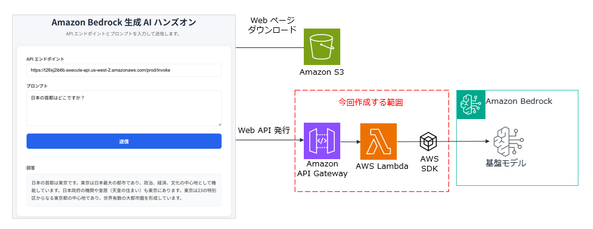

# Amazon Bedrock ハンズオン - 生成 AI Web アプリケーションの構築

## 概要

このハンズオンでは、Amazon Bedrock を使用した簡単な生成 AI Web アプリケーションを構築します。ユーザーが Web ページからプロンプトを送信すると、Amazon Bedrock（Amazon Nova Lite v1）が回答を生成して返します。

## アーキテクチャ

```

```

### 使用する AWS サービス

| サービス | 用途 |
|---------|------|
| Amazon S3 | Web ページのホスティング（構築済み） |
| Amazon API Gateway | REST API エンドポイント |
| AWS Lambda | バックエンド処理（Python 3.14） |
| Amazon Bedrock | 生成 AI（Amazon Nova Lite v1、クロスリージョン推論） |

## 前提条件

- AWS アカウントを持っていること
- AWS マネジメントコンソールにログインできること
- Amazon Bedrock で Amazon Nova Lite v1 モデルにアクセスできること

## ハンズオン手順

---

### ステップ 1: Lambda 関数を作成する

1. AWS マネジメントコンソールにログインします
2. 画面右上のリージョン選択で「**米国（オレゴン） us-west-2**」を選択します
3. サービス検索から「**lambda**」を開きます
4. 「**関数の作成**」をクリックします
5. 以下の設定で関数を作成します：

| 項目 | 値 |
|------|-----|
| 関数名 | `bedrock-genai-function` |
| ランタイム | Python 3.14 |

6. 「**関数を作成**」ボタンをクリックします

7. 「**Getting started**」のダイアログが表示された場合は 「**Dismiss**」ボタンをクリックして閉じます
---

### ステップ 2: Lambda 関数に Bedrock へのアクセス権限を付与する

1. 作成した Lambda 関数の画面で「**設定**」タブをクリックします
2. 左メニューから「**アクセス権限**」をクリックします
3. 「実行ロール」セクションのロール名リンクをクリックします（IAM コンソールが開きます）
4. 「**許可を追加**」→「**ポリシーをアタッチ**」をクリックします
5. 検索ボックスに `AmazonBedrockFullAccess` と入力します
6. 「**AmazonBedrockFullAccess**」にチェックを入れ、「**許可を追加**」をクリックします

---

### ステップ 3: Lambda 関数のコードを記述する

1. Lambda 関数の画面に戻り、「**コード**」タブをクリックします
2. `lambda_function.py` の内容をすべて削除し、以下のコードを貼り付けます：

```python
import json
import boto3

# Bedrock Runtime クライアントを作成
bedrock_runtime = boto3.client("bedrock-runtime", region_name="us-west-2")

# 使用するモデル ID（クロスリージョン推論プロファイル）
MODEL_ID = "us.amazon.nova-lite-v1:0"


def lambda_handler(event, context):
    """
    API Gateway から呼び出される Lambda 関数のハンドラー
    ユーザーのプロンプトを受け取り、Bedrock に問い合わせて結果を返す
    """
    try:
        # リクエストボディからプロンプトを取得
        body = json.loads(event["body"])
        user_prompt = body["prompt"]

        # Bedrock Converse API を呼び出す
        response = bedrock_runtime.converse(
            modelId=MODEL_ID,
            messages=[
                {
                    "role": "user",
                    "content": [
                        {
                            "text": user_prompt
                        }
                    ]
                }
            ]
        )

        # レスポンスからテキストを取得
        result_text = response["output"]["message"]["content"][0]["text"]

        # 成功レスポンスを返す
        return {
            "statusCode": 200,
            "headers": {
                "Content-Type": "application/json",
                "Access-Control-Allow-Origin": "*",
                "Access-Control-Allow-Headers": "Content-Type",
                "Access-Control-Allow-Methods": "POST, OPTIONS"
            },
            "body": json.dumps({
                "response": result_text
            }, ensure_ascii=False)
        }

    except Exception as e:
        # エラーレスポンスを返す
        print(f"エラーが発生しました: {str(e)}")
        return {
            "statusCode": 500,
            "headers": {
                "Content-Type": "application/json",
                "Access-Control-Allow-Origin": "*",
                "Access-Control-Allow-Headers": "Content-Type",
                "Access-Control-Allow-Methods": "POST, OPTIONS"
            },
            "body": json.dumps({
                "error": "内部エラーが発生しました。"
            }, ensure_ascii=False)
        }
```

3. 「**Deploy**」ボタンをクリックしてコードをデプロイします

---

### ステップ 4: Lambda 関数のタイムアウトを変更する

Bedrock の応答には時間がかかる場合があるため、タイムアウトを延長します。

1. 「**設定**」タブをクリックします
2. 「**一般設定**」をクリックし、「**編集**」をクリックします
3. タイムアウトを **30 秒** に変更します
4. 「**保存**」をクリックします

---

### ステップ 5: API Gateway を作成する

1. AWS マネジメントコンソールで、サービス検索から「**API Gateway**」を開きます
1. 「**API の作成**」をクリックします
1. 「**REST API**」の「**構築**」をクリックします（「REST API プライベート」ではありません）
1. 以下の設定で API を作成します：

| 項目 | 値 |
|------|-----|
| API 名 | `bedrock-genai-api` |
| 説明 | Bedrock ハンズオンの API |
| エンドポイントタイプ | リージョン |

1. 「**API を作成**」をクリックします

---

### ステップ 6: API Gateway にリソースとメソッドを作成する

#### リソースの作成

1. 「**リソースを作成**」をクリックします
2. リソース名に `invoke` と入力します
3. 「**CORS (クロスオリジンリソース共有)**」にチェックを入れます
4. 「**リソースを作成**」をクリックします

#### メソッドの作成

1. `/invoke` リソースを選択した状態で「**メソッドを作成**」をクリックします
2. 以下の設定でメソッドを作成します：

| 項目 | 値 |
|------|-----|
| メソッドタイプ | POST |
| 統合タイプ | Lambda 関数 |
| Lambda プロキシ統合 | ✅ 有効にする |
| Lambda 関数 | `bedrock-genai-function` |

3. 「**メソッドを作成**」をクリックします
4. Lambda 関数に権限を追加するダイアログが表示された場合は「**OK**」をクリックします

---

### ステップ 7: API をデプロイする

1. 「**API をデプロイ**」をクリックします
2. 以下の設定でデプロイします：

| 項目 | 値 |
|------|-----|
| ステージ | *新しいステージ* |
| ステージ名 | `prod` |

3. 「**デプロイ**」をクリックします
4. 表示される「**URL を呼び出す**」の値をコピーします

   例: `https://xxxxxxxxxx.execute-api.us-west-2.amazonaws.com/prod`

> ⚠️ **重要**: この URL は次のステップで使用します。メモ帳などに控えておいてください。

---

### ステップ 8: 動作確認

1. 以下の URL にアクセスします：

   `https://tnobep-work-public.s3.ap-northeast-1.amazonaws.com/bedrock-work/index.html`

2. Web ページが表示されたら、以下の操作を行います：
   - 「**API エンドポイント**」欄に、ステップ 7 でコピーした URL の末尾に `/invoke` を追加して入力します
     - 例: `https://xxxxxxxxxx.execute-api.us-west-2.amazonaws.com/prod/invoke`
   - 「**プロンプト**」欄に質問を入力します（例：「日本の首都はどこですか？」）
   - 「**送信**」ボタンをクリックします

3. 数秒後、ページ下部に Amazon Bedrock（Nova Lite）からの回答が表示されます 🎉

---

## トラブルシューティング

### 「Internal Server Error」が表示される場合

- Lambda 関数のタイムアウトが短すぎないか確認してください（30 秒推奨）
- Lambda 関数の実行ロールに `AmazonBedrockFullAccess` が付与されているか確認してください
- CloudWatch Logs で Lambda 関数のログを確認してください

### 「CORS エラー」が表示される場合

- API Gateway のリソース作成時に CORS を有効にしたか確認してください
- API を再デプロイしてください

### 回答が返ってこない場合

- Amazon Bedrock のモデルアクセスが有効になっているか確認してください
- API Gateway の URL が正しいか確認してください（末尾に `/invoke` が必要です）

---

## クリーンアップ

ハンズオン終了後、以下のリソースを削除してください：

1. **Lambda 関数**: `bedrock-genai-function` を削除
2. **API Gateway**: `bedrock-genai-api` を削除
3. **IAM ロール**: Lambda 用に作成されたロールを削除（任意）

---

## 参考リンク

- [Amazon Bedrock ドキュメント](https://docs.aws.amazon.com/bedrock/)
- [Amazon Nova モデル](https://docs.aws.amazon.com/nova/)
- [AWS Lambda ドキュメント](https://docs.aws.amazon.com/lambda/)
- [Amazon API Gateway ドキュメント](https://docs.aws.amazon.com/apigateway/)
