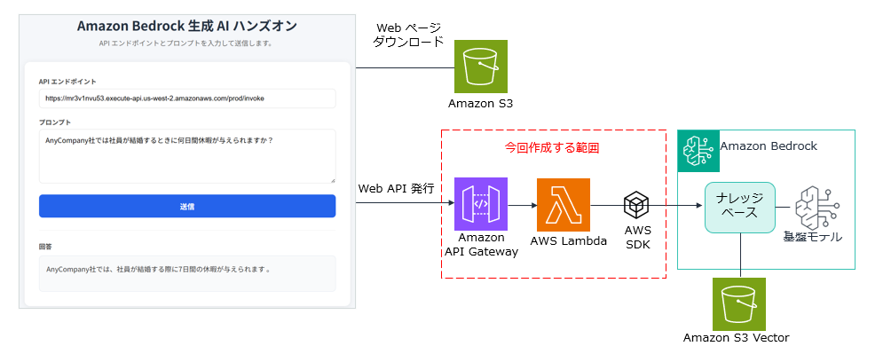

# Amazon Bedrock ハンズオン - ナレッジベース（RAG）Web アプリケーションの構築

## 概要

このハンズオンでは、Amazon Bedrock のナレッジベースを使用した RAG（Retrieval-Augmented Generation）Web アプリケーションを構築します。ユーザーが Web ページからプロンプトを送信すると、ナレッジベースに登録されたドキュメントを検索し、その内容をもとに回答を生成して返します。

## アーキテクチャ



### 使用する AWS サービス

| サービス | 用途 |
|---------|------|
| Amazon S3 | Web ページのホスティング（構築済み） |
| Amazon API Gateway | REST API エンドポイント |
| AWS Lambda | バックエンド処理（Python 3.14） |
| Amazon Bedrock ナレッジベース | RAG による回答生成 |

## 前提条件

- AWS アカウントを持っていること
- AWS マネジメントコンソールにログインできること
- Amazon Bedrock のナレッジベースが作成済みであること
- ナレッジベースの ID を把握していること

## ハンズオン手順

---

### ステップ 1: ナレッジベースの ID を確認する

1. AWS マネジメントコンソールにログインします
2. 画面右上のリージョン選択で「**米国西部（オレゴン） us-west-2**」を選択します
3. サービス検索で「**Bedrock**」と入力し、Amazon Bedrock コンソールを開きます
4. 左メニューから「**ナレッジベース**」をクリックします
5. 使用するナレッジベースの名前をクリックします
6. 「**ナレッジベースの概要**」セクションに表示されている「**ナレッジベース ID**」をコピーします

> ⚠️ **重要**: この ID は後のステップで Lambda 関数のコードに設定します。メモ帳などに控えておいてください。

---

### ステップ 2: Lambda 関数を作成する

1. サービス検索から「**Lambda**」を開きます
2. 「**関数の作成**」をクリックします
3. 以下の設定で関数を作成します：

| 項目 | 値 |
|------|-----|
| 関数名 | `bedrock-rag-function` |
| ランタイム | Python 3.14 |

4. 「**関数を作成**」ボタンをクリックします

5. 「**Getting started**」のダイアログが表示された場合は 「**Dismiss**」ボタンをクリックして閉じます

---

### ステップ 3: Lambda 関数に Bedrock へのアクセス権限を付与する

1. 作成した Lambda 関数のページで「**設定**」タブをクリックします
2. 左メニューから「**アクセス権限**」をクリックします
3. 「実行ロール」セクションのロール名リンクをクリックします（IAM コンソールが開きます）
4. 「**許可**」タブで、「**許可を追加**」→「**ポリシーをアタッチ**」をクリックします
5. 検索ボックスに `AmazonBedrockFullAccess` と入力します
6. 「**AmazonBedrockFullAccess**」にチェックを入れ、「**許可を追加**」をクリックします

---

### ステップ 4: Lambda 関数のコードを記述する

1. Lambda 関数のページに戻り、「**コード**」タブをクリックします
2. `lambda_function.py` の内容をすべて削除し、以下のコードを貼り付けます：

```python
import json
import boto3

# Bedrock Agent Runtime クライアントを作成
bedrock_agent_runtime = boto3.client("bedrock-agent-runtime", region_name="us-west-2")

# ナレッジベース ID（ステップ 1 で確認した ID に置き換えてください）
KNOWLEDGE_BASE_ID = "ここにナレッジベース ID を入力"


def lambda_handler(event, context):
    """
    API Gateway から呼び出される Lambda 関数のハンドラー
    ユーザーのプロンプトを受け取り、ナレッジベースに問い合わせて結果を返す
    """
    try:
        # Lambda 関数の ARN からアカウント ID を取得
        account_id = context.invoked_function_arn.split(":")[4]

        # 使用するモデル ARN（クロスリージョン推論プロファイル）
        model_arn = f"arn:aws:bedrock:us-west-2:{account_id}:inference-profile/us.amazon.nova-lite-v1:0"

        # リクエストボディからプロンプトを取得
        body = json.loads(event["body"])
        user_prompt = body["prompt"]

        # Bedrock RetrieveAndGenerate API を呼び出す
        response = bedrock_agent_runtime.retrieve_and_generate(
            input={
                "text": user_prompt
            },
            retrieveAndGenerateConfiguration={
                "type": "KNOWLEDGE_BASE",
                "knowledgeBaseConfiguration": {
                    "knowledgeBaseId": KNOWLEDGE_BASE_ID,
                    "modelArn": model_arn
                }
            }
        )

        # レスポンスからテキストを取得
        result_text = response["output"]["text"]

        # 成功レスポンスを返す
        return {
            "statusCode": 200,
            "headers": {
                "Content-Type": "application/json",
                "Access-Control-Allow-Origin": "*",
                "Access-Control-Allow-Headers": "Content-Type",
                "Access-Control-Allow-Methods": "POST, OPTIONS"
            },
            "body": json.dumps({
                "response": result_text
            }, ensure_ascii=False)
        }

    except Exception as e:
        # エラーレスポンスを返す
        print(f"エラーが発生しました: {str(e)}")
        return {
            "statusCode": 500,
            "headers": {
                "Content-Type": "application/json",
                "Access-Control-Allow-Origin": "*",
                "Access-Control-Allow-Headers": "Content-Type",
                "Access-Control-Allow-Methods": "POST, OPTIONS"
            },
            "body": json.dumps({
                "error": "内部エラーが発生しました。"
            }, ensure_ascii=False)
        }
```

3. **重要**: コード内の `KNOWLEDGE_BASE_ID` を、ステップ 1 で確認したナレッジベース ID に置き換えてください
4. 「**Deploy**」ボタンをクリックしてコードをデプロイします

---

### ステップ 5: Lambda 関数のタイムアウトを変更する

ナレッジベースの検索と回答生成には時間がかかる場合があるため、タイムアウトを延長します。

1. 「**設定**」タブをクリックします
2. 「**一般設定**」をクリックし、「**編集**」をクリックします
3. タイムアウトを **30 秒** に変更します
4. 「**保存**」をクリックします

---

### ステップ 6: API Gateway を作成する

1. AWS マネジメントコンソールで、サービス検索から「**API Gateway**」を開きます
2. 「**API を作成**」をクリックします
3. 「**REST API**」の「**構築**」をクリックします（「REST API プライベート」ではありません）
4. 以下の設定で API を作成します：

| 項目 | 値 |
|------|-----|
| API 名 | `bedrock-rag-api` |
| 説明 | Bedrock ナレッジベースハンズオンの API |
| エンドポイントタイプ | リージョン |

5. 「**API を作成**」をクリックします

---

### ステップ 7: API Gateway にリソースとメソッドを作成する

#### リソースの作成

1. 「**リソースを作成**」をクリックします
2. リソース名に `invoke` と入力します
3. 「**CORS (クロスオリジンリソース共有)**」にチェックを入れます
4. 「**リソースを作成**」をクリックします

#### メソッドの作成

1. `/invoke` リソースを選択した状態で「**メソッドを作成**」をクリックします
2. 以下の設定でメソッドを作成します：

| 項目 | 値 |
|------|-----|
| メソッドタイプ | POST |
| 統合タイプ | Lambda 関数 |
| Lambda プロキシ統合 | ✅ 有効にする |
| Lambda 関数 | `bedrock-rag-function` |

3. 「**メソッドを作成**」をクリックします
4. もし Lambda 関数に権限を追加するダイアログが表示された場合は「**OK**」をクリックします

---

### ステップ 8: API をデプロイする

1. 「**API をデプロイ**」をクリックします
2. 以下の設定でデプロイします：

| 項目 | 値 |
|------|-----|
| ステージ | *新しいステージ* |
| ステージ名 | `prod` |

3. 「**デプロイ**」をクリックします
4. 表示される「**URL を呼び出す**」の値をコピーします

   例: `https://xxxxxxxxxx.execute-api.us-west-2.amazonaws.com/prod`

> ⚠️ **重要**: この URL は次のステップで使用します。メモ帳などに控えておいてください。

---

### ステップ 9: 動作確認

1. 以下の URL にアクセスします（講師から案内されます）：

   `https://tnobep-work-public.s3.ap-northeast-1.amazonaws.com/bedrock-work/index.html`

2. Web ページが表示されたら、以下の操作を行います：
   - 「**API エンドポイント**」欄に、ステップ 8 でコピーした URL の末尾に `/invoke` を追加して入力します
     - 例: `https://xxxxxxxxxx.execute-api.us-west-2.amazonaws.com/prod/invoke`
   - 「**プロンプト**」欄にナレッジベースに登録したドキュメントに関する質問を入力します
       - 例：
       - ```
         AnyCompany社では社員が結婚するときに何日間休暇が与えられますか？
         ```
       - ```
         AnyCompany社の就業規則は労働基準法の第何条に基づいて規定されていますか？
         ```
       - ```
         AnyCompany社では社員が裁判員になった場合に休暇は与えられますか？
         ```
       - ```
         AnyCompany社では取得しなかった有給休暇は繰越すことができますか？
         ```
   - 「**送信**」ボタンをクリックします

3. 数秒後、ページ下部にナレッジベースの情報をもとにした回答が表示されます 🎉

---

## トラブルシューティング

### 「Internal Server Error」が表示される場合

- Lambda 関数のタイムアウトが短すぎないか確認してください（30 秒推奨）
- Lambda 関数の実行ロールに `AmazonBedrockFullAccess` が付与されているか確認してください
- Lambda コード内の `KNOWLEDGE_BASE_ID` が正しいか確認してください
- CloudWatch Logs で Lambda 関数のログを確認してください

### 「CORS エラー」が表示される場合

- API Gateway のリソース作成時に CORS を有効にしたか確認してください
- API を再デプロイしてください

### 回答が返ってこない場合

- ナレッジベースが正しく作成され、データソースが同期済みか確認してください
- API Gateway の URL が正しいか確認してください（末尾に `/invoke` が必要です）

---

## クリーンアップ

ハンズオン終了後、以下のリソースを削除してください：

1. **Lambda 関数**: `bedrock-rag-function` を削除
2. **API Gateway**: `bedrock-rag-api` を削除
3. **IAM ロール**: Lambda 用に作成されたロールを削除（任意）

---

## 参考リンク

- [Amazon Bedrock ナレッジベース ドキュメント](https://docs.aws.amazon.com/bedrock/latest/userguide/knowledge-base.html)
- [RetrieveAndGenerate API リファレンス](https://docs.aws.amazon.com/bedrock/latest/APIReference/API_agent-runtime_RetrieveAndGenerate.html)
- [AWS Lambda ドキュメント](https://docs.aws.amazon.com/lambda/)
- [Amazon API Gateway ドキュメント](https://docs.aws.amazon.com/apigateway/)
